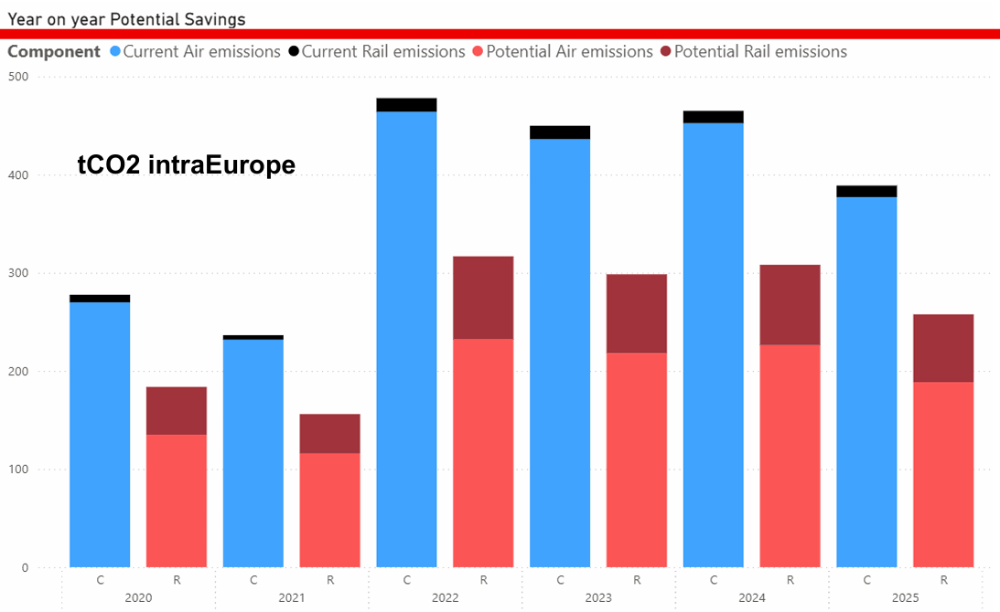
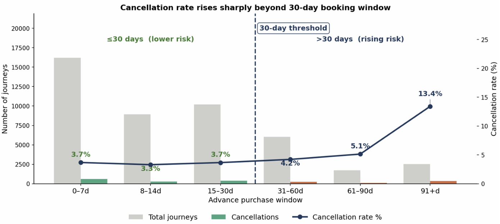
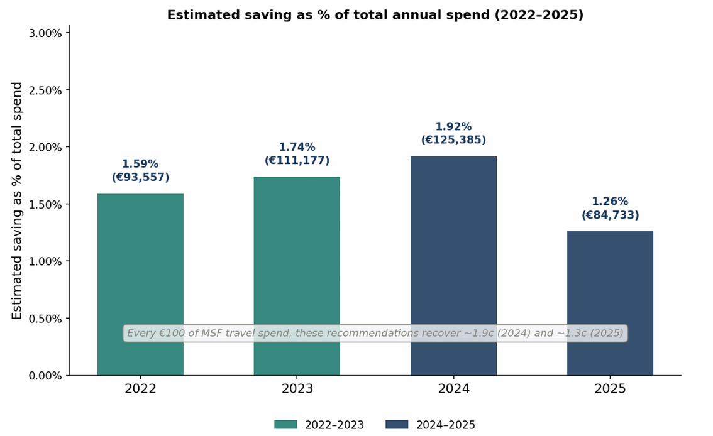

# travel-analytics-cost-sustainability
Live consulting project delivered for Doctors Without Borders (MSF). Using Python and Power BI to transform fragmented travel data into journey-level insights, identifying opportunities to reduce costs, minimise disruption and support sustainability through improved travel planning and policy decisions.

# Using Travel Analytics to Reduce Cost, Disruption and Carbon Impact

## Overview
As part of a multidisciplinary team, I partnered with Doctors Without Borders (MSF) to analyse fragmented travel records and transform them into meaningful journey-level insights. The project combined travel analytics, operational analysis and sustainability reporting to identify opportunities to improve planning, reduce costs and minimise carbon emissions without restricting mission-critical travel.

## Business Problem
MSF relies heavily on international travel to support humanitarian operations, but fragmented travel records made it difficult to analyse spend, disruption, traveller behaviour and environmental impact at a journey level.

The objective of this project was to reconstruct travel data into a usable analytical dataset, identify opportunities to improve travel planning and reduce avoidable costs, and assess how travel policies could support both operational efficiency and sustainability goals.

## Approach
- Worked as part of a five-person consulting team on a live client project with MSF
- Cleaned and transformed over 190,000 travel records using Python
- Reconstructed fragmented transaction data into a journey-level dataset
- Analysed travel spend, booking behaviour, cancellations and emissions
- Built visualisations and dashboards to support stakeholder decision-making
- Developed evidence-based recommendations and quantified their potential impact

## Key Insights
- Cancellation rates followed a recurring first-quarter pattern, indicating planning uncertainty
- Journeys booked more than 90 days in advance showed significantly higher cancellation rates
- Non-refundable fares did not consistently reduce costs and were associated with higher disruption
- Intra-European rail substitution represented a significant opportunity to reduce both travel costs and carbon emissions
- Travel behaviour patterns highlighted opportunities for improved planning and policy development

## Recommendations
- Introduce a Q1 mission-planning review to reduce avoidable cancellations
- Implement a default 30-day booking window, with documented exceptions where required
- Make refundable fares the default option for mission travel
- Introduce rail-substitution prompts for suitable European routes

## Tools Used
Python, Power BI, Travel Analytics, Data Wrangling, Data Cleaning, Journey Reconstruction, Data Engineering, Sustainability Analytics, Carbon Emissions Analysis, Operational Analytics, Cost Optimisation, Data Visualisation, Business Intelligence, Forecasting, Cross-Functional Collaboration, Stakeholder Storytelling

## Key Visuals
### Sustainability Opportunity Analysis
[

### Booking Behaviour Analysus
[

### Cost Saving Potential Analysis
[

## What I'd Do Next
This project identified several behavioural patterns linked to disruption and avoidable cost, but could not fully explain the operational factors behind them. As a next step, I would work with travel coordinators and operational teams to better understand booking decisions, exceptions and mission requirements. Combining operational context with the analytical findings would help refine travel policies and improve the accuracy of future recommendations.
